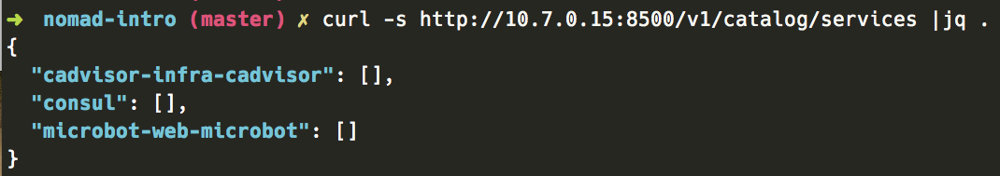
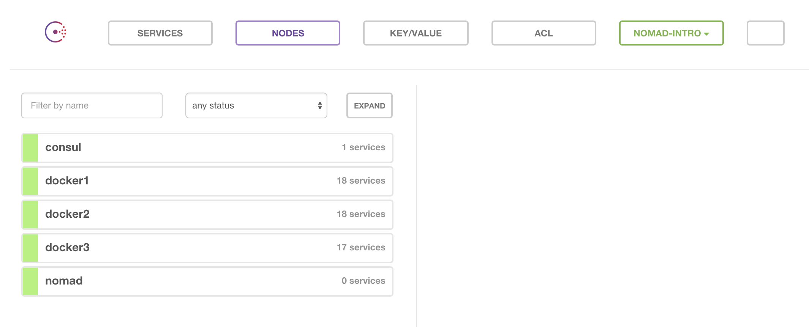

# Introduction to Nomad

## Introducing Cluster Schedulers
Are you still running all of your containers with a single DOCKER_HOST? Have you managed to spread the load between two or three hosts but manually call `docker run` commands on each host to bootstrap your container infrastructure? If so, you should consider using a container scheduler instead.

Fleet, Kubernetes, Mesos, Nomad, Rancher, and Swarm are probably names you've heard of recently but are you familiar with what they actually do? Schedulers provide many benefits in a containerized environment. They are the next big step once you've played with a local development environment or when you are going to deploy your CI/CD pipeline. Container schedulers vary in their features and implementation but some of the core principles are the same.

* **Pool resources** from a group of hosts into their components (CPU/RAM) and make them available for consumption. Also make sure the resources don't become exhausted via over-provisioning or host failure.
* **Service supervision** provides a service load balancer/entry point and make sure the service remains running.
* **Scaling functionality** scales a service (automatic or manually) by allowing an operator to create more or fewer instances.
* **System metadata** provides stats about running instances, scheduling, and container health.

Running a scheduler has obvious benefits over running containers by hand, but to run some of these schedulers requires a long list of dependencies that are not trivial to set up and maintain. Enter Hashicorp's Nomad, from the team that brought you [Consul](https://www.consul.io/), [Vagrant](https://www.vagrantup.com/), [Packer](https://www.packer.io/), [Terraform](https://terraform.io/), [Vault](https://www.vaultproject.io/), and recently [Otto](https://ottoproject.io/). Nomad attempts to give you all of the container scheduler benefits without any of the complexity. It is a single binary and optional config file making it simple to deploy and get started. You don't need to make any changes to your existing containers and can get started with just a few commands.

## Understanding Nomad
Nomad is built to be operationally simple. So simple that we can easily create an example cluster to play with on your local machine.

We are going to leverage Vagrant to automatically provision multiple machines that we can use to demonstrate container scheduling with Nomad. These machines will be:
* Nomad server (1)
* Consul server (1)
* Docker host (3)

We will explain more about what each VM will do as we go. To get started, perform a git clone on [nomad-intro](https://github.com/dontrebootme/nomad-intro). Make sure you have [Vagrant installed](https://docs.vagrantup.com/v2/installation/).

```
git clone https://github.com/dontrebootme/nomad-intro
cd nomad-intro
vagrant up
```

This process starts and configures a Consul server, Nomad server, and some Docker hosts running Nomad and Consul agent. Once vagrant is done provisioning the VMs run `vagrant status` to confirm all instances are running:

```
➜  nomad-intro (master) ✔
 vagrant status
Current machine states:

consul                    running (virtualbox)
nomad                     running (virtualbox)
docker1                   running (virtualbox)
docker2                   running (virtualbox)
docker3                   running (virtualbox)
```

### Nomad Server
Nomad running in server mode acts as the manager for the agents and applications in your cluster. A normal production cluster would have multiple Nomad servers for redundancy and failover. We describe how we want Nomad to run our applications by defining jobs. I've included a sample job with a task that launches a web server in the [nomad-intro](https://github.com/dontrebootme/nomad-intro) repository. The `.nomad` file defines a job, task group, and task. A job file will only ever describe a single job, but can have multiple tasks. Additional definitions in the job definition include data such as datacenter, region, instance count, update policy, resources allocated, networking speed, port allocations, and health checks.

In addition to nomad running the server, it also is the same binary used to interact with the cluster. To demonstrate how we schedule a job with nomad, take a look at the provided `microbot.nomad` file. You can run the microbot service on your cluster by issuing:

```
vagrant ssh nomad
nomad run /vagrant/microbot.nomad
```

Nomad will recieve the job definition and act on the request by scheduling the job on the [agent nodes](#agents). You can view the status of the deployment with `nomad status microbot`.

### <a name="agents"></a>Nomad Agent
Nomad running in agent mode will receive requests for tasks from the server and, if possible, act on those requests. In the example above we asked Nomad to start 9 instances of the microbot task which in this example are webservers running in a Docker container as defined by the job definition. We asked Nomad to allocate ports for the containers we launched and monitor the health of those services to act on them should the health check ever fail.

### Consul
Consul is typically seen as two components, service discovery and distributed key value storage. We will focus on the service discovery portion of Consul for an automated way to discover and query our servers that may exist around our environment. Consul works well with Nomad, not surprisingly, because Nomad can automatically inform Consul of all running services, their host and port, and the health of the services.

With Nomad and Consul in sync, we can automate other systems such as the load balancer to automatically update when containers move or when containers are created and destroyed with scaling.

### Further Experimentation:
Now that we've covered Nomad server, agent, and how we can leverage Consul for service discovery, let's do some further demonstrations of interacting with Nomad for tasks such as:
* [Scale the microbot service](#scale)
* [Rolling updates](#update)
* [System jobs](#system)
* [Query Consul](#query)

#### <a name="scale"></a>Scale the Microbot Service
Let's demonstrate the ability to use Nomad to scale a service. Open the `microbot.nomad` file with your favorite text editor and change the `instance` value from `9` to `50`.
```
...
group "webs" {
  # We want 9 web servers initially
  count = 50

  task "microbot" {
    driver = "docker"
...
```
Once you're done, tell Nomad to about our changes by running:
```
vagrant ssh nomad
nomad run /vagrant/microbot.nomad
```
Nomad will look at the new job definition and make sure your cluster count matches what is already running. In this case it will scale the service up with an additional 41 containers.

#### <a name="update"></a>Rolling Updates
To demonstrate a rolling update, let's look at our job file `microbot.nomad` once again.
```
...
# Rolling updates should follow this policy
update {
  stagger = "10s"
  max_parallel = 5
}
...
```

`stagger` defines the time between new container deployments and `max_parallel` sets how many containers can be stopped and started in parallel.

We can push a new version of our container out by changing the version of our microbot container image from `v1` to `v2` in the `microbot.nomad` file.

```
task "microbot" {
  driver = "docker"
  config {
    image = "dontrebootme/microbot:v2"
  }
  service {
    port = "http"
```
Once you push the new application with `nomad run /vagrant/microbot.nomad` the containers will be updated, 5 at a time with 10 seconds between each batch.

More information about updates are available via the [Nomad documentation](https://nomadproject.io/docs/jobspec/#update)

#### <a name="system"></a>System Jobs
Nomad has three types of jobs: [service, batch, and system](https://www.nomadproject.io/docs/jobspec/schedulers.html). Our previous example used a `service` job which is intended for long running tasks. Let's schedule a new job of `type = "system"`. If you take a look at `cadvisor.nomad`, you'll see an example of a system job. System jobs are great for deploying services/tools that you expect to be on every host. You would usually use this type of job for logging, monitoring, and possibly a local docker registry. In this example we'll use the metrics service [cAdvisor](https://github.com/google/cadvisor). Let's deploy this on every Nomad client/Docker host by issuing our `nomad run` with this new job definition:
```
vagrant ssh nomad
nomad run /vagrant/cadvisor.nomad
```

To verify that it is running on all hosts run:
```
vagrant ssh nomad
nomad status cadvisor
```
The cadvisor job should be scheduled, one per host, on your cluster.

#### <a name="query"></a>Query Consul
One of the features of Nomad is that it has native integration with Consul. We've covered the relationship of Nomad and Consul above, but we can take a look at Consul and verify that it is indeed receiving all the information about our services by using Consul data in two ways, via an API call, or via the web UI.

To ask Consul for all running services in our cluster:
```
# List running services
curl -s http://10.7.0.15:8500/v1/catalog/services
# List information about our microbot service
curl -s http://10.7.0.15:8500/v1/catalog/service/microbot-web-microbot
```


Or we can visit the web UI by browsing to http://10.7.0.15:8500/ui/


## Spin Down and Clean Up

When you're done, you can shut down the cluster using
```
vagrant halt

# And free up some disk space using
vagrant destroy -f

# If you want to change any of the configuration/scripts run
vagrant provision
```

## Conclusion
There are numerous options for container cluster schedulers and the list isn't getting shorter. Nomad's approach to keep things operationally simple with less infrastructure needs is a relief when some schedulers seem overly complex. This model allows for fast automation and lean system requirements. We've learned how we can leverage Nomad to distribute a task around multiple hosts, scale the services, and deploy updates while letting the cluster scheduler handle the placement, supervision, and rolling updates. If you're ready to take your container infrastructure to the next level but are looking for a simple scheduler to deploy and manage then Nomad may be the container scheduler you've been waiting for.
